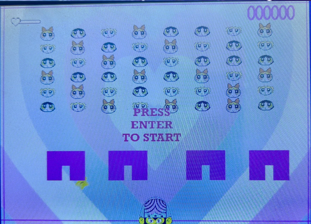
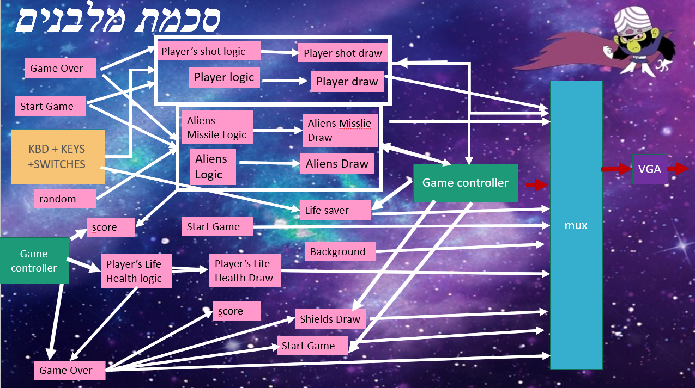
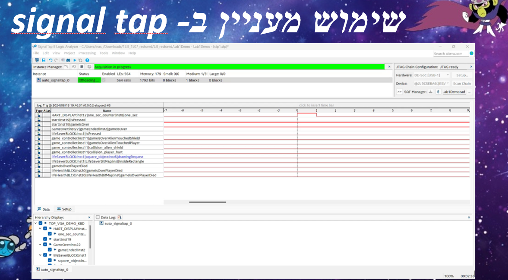

# Space Invaders (FPGA Project)

Hardware implementation of a Space Invaders-style game using **SystemVerilog** and **Quartus** with VGA display output.  
Developed as part of Lab 1A (2024) at Technion.

---

## 🎮 Game Overview
- **Goal:** Defeat all invaders (Blossom, Bubbles, Buttercup) before losing 4 lives.  
- **Player controls:**  
  - `4` → move left  
  - `6` → move right  
  - `8` → shoot  
  - `2` → control the life-saver star  
- **Mechanics:**  
  - Invaders shoot missiles randomly.  
  - Player is protected by 4 shields that degrade on impact (by invader or player shots).  
  - Hitting an invader transforms it into a temporary heart; if not rescued by the star, it disappears and increases score.  
  - Game ends when:
    1. Player loses 4 lives  
    2. All invaders are destroyed  
    3. Invaders collide with player shields  

---

## 🛠️ Architecture
- **Game Controller:** Handles collisions, game states, and overall logic.  
- **Player Module:** Controls player movement and shooting.  
- **Aliens Module:** Handles invader movement, random shooting, and transformation into hearts.  
- **Shields Module:** Renders shields and manages damage.  
- **Life Saver Module:** Manages the rescuing star that can revive invaders.  
- **Interface Module:** Displays start/game-over screens, health bar, score, and keyboard input.  
- **Clock Divider:** Provides proper frequency for gameplay timing.  
- **VGA Controller + MUX:** Renders graphics to the display.  

---

## 🧪 Tools & Technologies
- **HDL:** SystemVerilog  
- **Simulation:** ModelSim  
- **FPGA Toolchain:** Quartus Prime  
- **Debugging:** SignalTap logic analyzer  
- **Display:** VGA output  

---

## 📸 Screenshots / Diagrams

